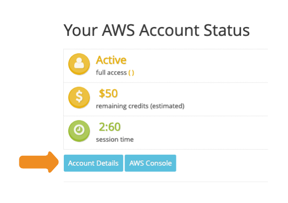
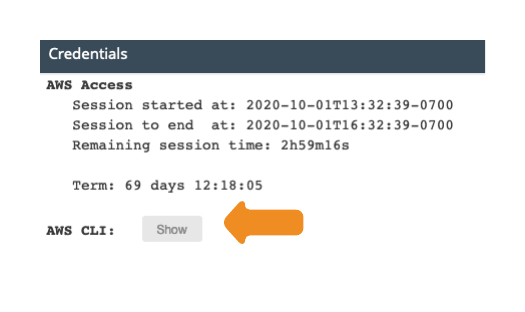
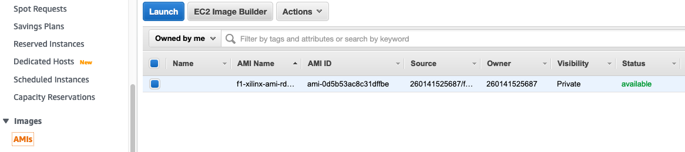
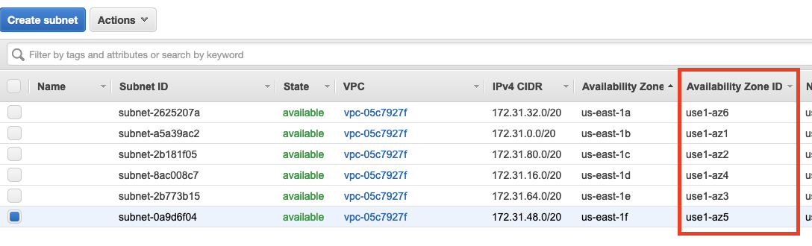

# How to Create a FPGA Developer AMI for Educators Using Packer

## Prerequisites

* You will need an AWS account with IAM credentials.
* Your AWS Account must have a default VPC.

⚠️**NOTE:** If your account lacks a default VPC, you can specify one in the packer template. 
See the [packer documentation](https://www.packer.io/docs/builders/amazon/ebs) for more information.

## Setup

**1. Clone the repository**

```
git clone https://github.com/aws-samples/aws-fpga-classroom-setup.git
cd src/build_recipes/al2/
```

**1. Download and install packer**
  
See this documentation for how to install packer: https://learn.hashicorp.com/tutorials/packer/getting-started-install

**2. Download Xilinx Web Installer from the Xilinx downloads website:**

* Xilinx 2020.1 Tools: https://www.xilinx.com/member/forms/download/xef.html?filename=Xilinx_Unified_2020.1_0602_1208_Lin64.bin
* Xilinx 2020.2 Tools: https://www.xilinx.com/member/forms/download/xef.html?filename=Xilinx_Unified_2020.2_1118_1232_Lin64.bin

**3a. Obtain your AWS credentials (AWS Console)**
Follow the instructions [here](https://docs.aws.amazon.com/cli/latest/userguide/cli-configure-quickstart.html#cli-configure-quickstart-creds) to get your AWS Credentials.

**3b. Obtain your AWS credentials (AWS Classroom)**
**i. Log into your AWS Classroom, and select "Account Details"**



**ii. Click the "Show" button next to "AWS CLI:" Copy these credentials to a safe place, you'll need them later.**




## Build the Image

**4. Copy the Xilinx installer to the `./files` directory**

If you have a license file, copy that to the `./files` directory as well.

**5. Modify the variables in `ansible/xilinx_playbook.yaml`**

You must provide your xilinx.com credentials (`xilinx_username` and `xilinx_password`).

To disable rdp or dcv, set the `install_rdp` or `install_dcv` variables to `false`.

⚠️**Note:** YAML files are very particular about indentation. Be sure to keep the indentation the same when editing the playbook.

```yaml
vars:
  # Modify these variables for your environment
  xilinx_username: 'user@example.com'
  xilinx_password: 'mypassword'
  xilinx_installer: 'Xilinx_Unified_2020.1_0602_1208_Lin64.bin'
  # Set these to "false" to disable rdp or dcv
  install_rdp: true
  install_dcv: true
```
⚠️**Note:** The Xilinx installer will reject passwords that contain the `@` symbol. 
If your password contains an `@`, please change your Xilinx.com password to something else.

**6. Update the `packer_xilinx_template.json` file.**

Enter your AWS credentials from Step 2 into `aws_access_key`, `aws_secret_key`, and `aws_session_token`, replacing both sets of brackets.  

(Optional) Specify a name for the AMI in `ami_name`.

(Optional) If you'd like to build on a different instance type, you can modify `instance_type`. The default is an m5.2xlarge which should work within AWS Academy's limits.

**Note:** `instance type` refers to the instance that you will use to build the image, not the F1 instance that you will use later.
```json
"variables": {
  "aws_access_key": "{{env `AWS_ACCESS_KEY_ID`}}",
  "aws_secret_key": "{{env `AWS_SECRET_ACCESS_KEY`}}",
  "aws_session_token": "{{env `AWS_SESSION_TOKEN`}}",
  "region": "us-east-1",
  "instance-type": "m5.2xlarge",
  "ami_name": "packer-linux-aws-demo-{{timestamp}}"
}
```

**7. Run `packer build packer_xilinx_template.json`**
The build will take a bit more than two hours.


**8. Log into the AWS console to see the AMI**


⚠️**Note:** The ec2-user password will be set to the instance ID at launch (i.e. "i-043a81572c26828e6"). 
This can be changed by the user after they've launched the instance.

## How to Launch AMIs in Student Accounts

To reduce costs, students should develop their projects on m5.2xlarge instances and switch their instance type to F1 when ready to program the FPGA. 
Instructions on how to change instance types are available [here](https://docs.aws.amazon.com/AWSEC2/latest/UserGuide/ec2-instance-resize.html#resize-ebs-backed-instance).

⚠️**WARNING:** Within the Northern Virginia (us-east-1) there is one Availability Zone which does not support F1 instances: `use1-az3`. M5 instances launched in that Availability Zone will not upgrade to F1 instances. Students will see the following error when they attempt to launch an F1 instance:


Each AWS account has a different Availability Zone mapping. 
The Availability Zone us-east-1a for your AWS account might not have the same location as us-east-1a for another AWS account. 
It is recommended to use the Availability Zone ID, which is a unique and consistent identifier for an Availability Zone across AWS accounts. 

The Subnets page lists Availability Zone IDs:




⚠️**WARNING:** Do not launch instances in use-az3. To be safe, you can even delete the `use-az3` subnet (in this case `subnet-2b773b15`).

If you have access to the AWS CLI, you determine which Availability Zones support F1 instances with the following query:

```
$ aws ec2 describe-instance-type-offerings \
--location-type availability-zone \
--filters Name=instance-type,Values=f1.2xlarge \
--region us-east- 1 --output table
-------------------------------------------------------
| DescribeInstanceTypeOfferings |
+-----------------------------------------------------+
|| InstanceTypeOfferings ||
|+--------------+--------------+---------------------+|
|| InstanceType | Location | LocationType ||
|+--------------+--------------+---------------------+|
|| f1.2xlarge | us-east-1d | availability-zone ||
|| f1.2xlarge | us-east-1e | availability-zone ||
|| f1.2xlarge | us-east-1c | availability-zone ||
|| f1.2xlarge | us-east-1a | availability-zone ||
|| f1.2xlarge | us-east-1b | availability-zone ||
```

## Troubleshooting
[Check the troubleshooting page](./troubleshooting.md) for common problems and how to fix them.
